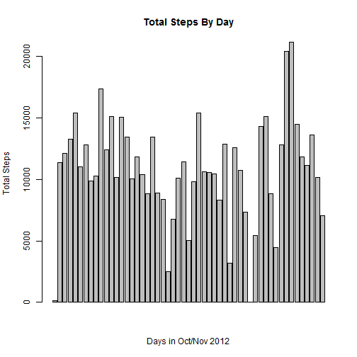
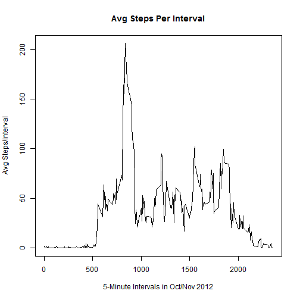
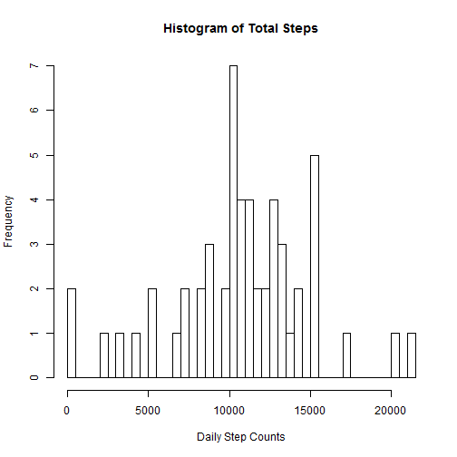
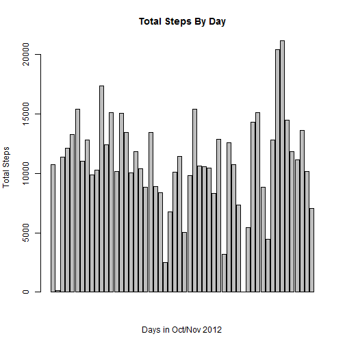

# Reproducible Research: Peer Assessment 1


## Loading and preprocessing the data

```r
# Read activity data as character data to prevent dates being interpreted as
# factors.  Then convert date column from character into Date type.
df <- read.csv("activity.csv", header = TRUE, as.is = TRUE)
df$date <- as.Date(df$date)
```


## What is mean total number of steps taken per day?

```r
# Per instructions, ignore missing values, so get them out of the way.
good.cases <- df[complete.cases(df), ]

# Calculate and display total steps per day.  Note: used a barplot, a
# histogram will not display by day, it will show the frequency distribution
# of the step counts over the total step counts.  So the assignment
# instructions were not clear in my opinion.  But I will also display the
# histogram.
total.steps.by.day <- aggregate(steps ~ date, good.cases, sum)
hist(total.steps.by.day$steps, main = "Histogram of Total Steps", xlab = "Daily Step Counts", 
    breaks = length(total.steps.by.day$steps))
```

 

```r
barplot(total.steps.by.day$steps, main = "Total Steps By Day", xlab = "Days in Oct/Nov 2012", 
    ylab = "Total Steps")
```

 

```r

# Calculate and display the median steps per day
mean(total.steps.by.day$steps)
```

```
## [1] 10766
```

```r
median(total.steps.by.day$steps)
```

```
## [1] 10765
```


## What is the average daily activity pattern?

```r
avg.steps.by.interval <- aggregate(steps ~ interval, good.cases, mean)
plot(avg.steps.by.interval$interval, avg.steps.by.interval$steps, type = "l", 
    main = "Avg Steps Per Interval", xlab = "5-Minute Intervals in Oct/Nov 2012", 
    ylab = "Avg Steps/Interval")
```

 


## Imputing missing values

```r
# Return to data frame with NA steps values.  Re-calculate average steps
# based on interval, and then use the interval value (average) to 'fill in'
# any NA values in a new data set.
avg.steps.by.interval <- aggregate(steps ~ interval, df, mean)
imputed.df <- df
for (i in 1:length(imputed.df$steps)) {
    if (is.na(imputed.df$steps[i])) 
        imputed.df$steps[i] <- avg.steps.by.interval$steps[i]
}

# Now re-do the histogram, barplot, and report mean/median.
imputed.total.steps.by.day <- aggregate(steps ~ date, imputed.df, sum)
hist(imputed.total.steps.by.day$steps, main = "Histogram of Total Steps", xlab = "Daily Step Counts", 
    breaks = length(imputed.total.steps.by.day$steps))
```

 

```r
barplot(imputed.total.steps.by.day$steps, main = "Total Steps By Day", xlab = "Days in Oct/Nov 2012", 
    ylab = "Total Steps")
```

 

```r

# Calculate and display the median steps per day
mean(imputed.total.steps.by.day$steps)
```

```
## [1] 10766
```

```r
median(imputed.total.steps.by.day$steps)
```

```
## [1] 10766
```

```r

# Show the difference between the 'complete cases' and imputed values for
# mean,median.
mean(total.steps.by.day$steps) - mean(imputed.total.steps.by.day$steps)
```

```
## [1] 0
```

```r
median(total.steps.by.day$steps) - median(imputed.total.steps.by.day$steps)
```

```
## [1] -0.5943
```


## Are there differences in activity patterns between weekdays and weekends?

```r

# Add the weekday/weekend factor column.
day.names <- weekdays(imputed.df$date)
for (i in 1:length(day.names)) {
    if (day.names[i] == "Saturday" | day.names[i] == "Sunday") {
        day.names[i] <- "weekend"
    } else {
        day.names[i] <- "weekday"
    }
}

imputed.df$day_type <- as.factor(day.names)
imputed.df$avg_steps <- mean(imputed.total.steps.by.day$steps)

# Do the panel plot
library(lattice)
xyplot(df$interval ~ df$avg_steps | df$day_type)
```

```
## Error: need at least one panel
```

```r

```


